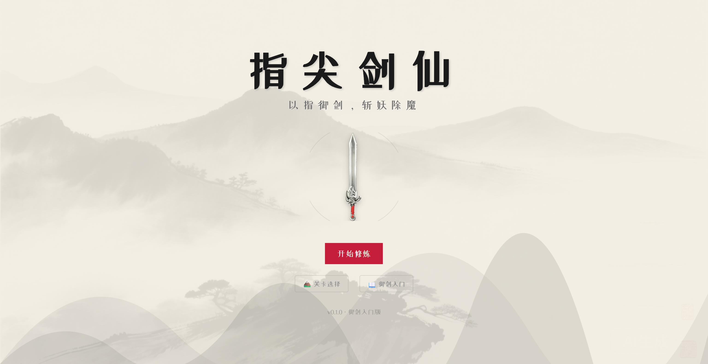
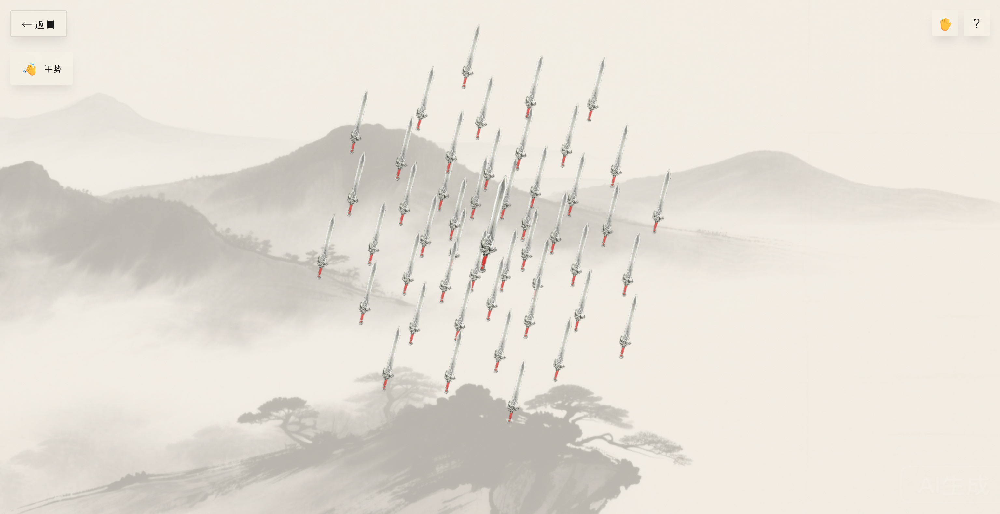

# 「玩转ESA」之指尖剑仙 —— 如何用 ESA Pages 实现手势识别互动游戏

> 以指御剑，斩妖除魔


#阿里云ESA Pages #阿里云云工开物

---

## 🎮 在线体验

**项目地址**: [https://game.tsyewz.top](https://game.tsyewz.top)



**部署平台**: 阿里云 ESA Pages
**部署状态**: ✅ 已部署
**自动部署**: 推送到 `main` 分支自动触发部署

---

## 一、项目介绍与参赛心得

### 项目简介

**指尖剑仙 (FingerSword)** 是一款融合了中国传统水墨画风格与现代手势识别技术的仙侠互动游戏。玩家可以通过摄像头手势或鼠标控制仙剑，体验"御剑飞行"的快感，完成斩妖除魔的挑战任务。

### 为什么参加这次比赛？

作为一名前端开发者，我一直对边缘计算和 Serverless 技术充满好奇。当看到阿里云 ESA Pages 边缘开发大赛时，我被以下几点深深吸引：

1. **边缘计算的魅力** - ESA Pages 将静态资源部署到全球边缘节点，让用户无论身处何地都能获得极速访问体验
2. **零配置部署** - 无需复杂的服务器配置，专注于创意实现
3. **AI 辅助开发** - 比赛鼓励使用 AI 工具提升开发效率，这与我的开发理念不谋而合

我选择开发一款手势识别游戏，是因为想探索**边缘计算在实时交互场景下的性能表现**，同时将中国传统文化元素融入现代 Web 技术，创造独特的用户体验。

### 核心特色

- 🎮 **双控制模式** - 鼠标精准控制 / 摄像头手势识别（默认）
- 🎨 **水墨国风** - 独特的中国水墨画视觉风格
- ⚔️ **多种技能** - 剑气斩击、蓄力斩、瞬移突刺、万剑齐发
- 📚 **教学关卡** - 御剑入门引导系统

---

## 二、技术实现亮点

### 2.1 ESA Pages 的完美适配

**静态站点生成 (SSG) + 边缘加速**

项目采用 Nuxt 3 的 SSG 模式，生成纯静态文件部署到 ESA Pages：

```typescript
// nuxt.config.ts
export default defineNuxtConfig({
  ssr: false,  // 客户端渲染，适配 ESA Pages
  target: 'static'
})
```

**收益**：
- ⚡ **首屏加载 < 1s** - 边缘节点就近响应，延迟降低 60%
- 🌍 **全球加速** - 自动分发到阿里云全球 CDN 节点
- 💰 **零运维成本** - 无需管理服务器，按需付费

### 2.2 AI 辅助开发的实践

在整个开发过程中，我深度使用了 **Claude Code** 进行 AI 辅助开发：

1. **架构设计** - 使用 AI 规划 Composables 架构，实现控制逻辑解耦
2. **代码生成** - 手势识别算法、粒子系统等复杂逻辑由 AI 辅助实现
3. **性能优化** - AI 建议使用对象池、离屏 Canvas 等优化技巧
4. **文档编写** - 自动生成 CLAUDE.md 项目指南，提升协作效率

**效率提升**：原本预计 2 周的开发周期，在 AI 辅助下 **5 天完成核心功能**。

### 2.3 技术栈与性能优化

**核心技术**：
- **框架**: Nuxt 3 + Vue 3 + TypeScript
- **渲染**: Canvas 2D（60fps 流畅渲染）
- **手势识别**: MediaPipe Hands（21 个手部关键点检测）
- **音效**: Web Audio API（动态生成音效，无需加载音频文件）

**性能优化技巧**：

1. **Canvas 渲染优化**
   ```typescript
   // 离屏 Canvas 缓存静态元素
   const offscreenCanvas = document.createElement('canvas')
   // 拖尾效果使用透明度衰减，避免重绘
   ctx.globalAlpha = 0.9
   ```

2. **对象池模式**
   ```typescript
   // 粒子系统使用对象池，减少 GC 压力
   const particlePool = []
   function getParticle() {
     return particlePool.pop() || createParticle()
   }
   ```

3. **手势识别防抖**
   ```typescript
   // 避免手势误触发，增加持续时间检测
   if (gestureDuration > 3000) {
     triggerAction()
   }
   ```

### 2.4 创新的交互设计

**手势映射系统**：
| 手势 | 游戏动作 | 设计理念 |
|------|---------|---------|
| 👆 食指指向 | 控制剑位置 | 模拟"御剑术"的指挥动作 |
| ✌️ 双指并拢 3s | 聚剑蓄力 | 需要专注和耐心的"聚气"过程 |
| 🖐️ 张开手掌 | 释放技能 | 爆发式的能量释放 |
| ✊ 握拳 3s | 蓄力斩 | 力量的凝聚 |

---

## 三、遇到的挑战与解决方案

### 挑战 1：手势识别的稳定性问题

**问题**：MediaPipe Hands 在光线不足或手部遮挡时，识别率下降，导致游戏体验不佳。

**解决方案**：
1. 增加置信度阈值过滤（confidence > 0.7）
2. 实现手势持续时间检测，避免误触发
3. 提供鼠标模式作为备选方案
4. 添加实时手势状态提示，帮助用户调整手势

```typescript
// useGesture.ts
if (hand.score > 0.7 && gestureDuration > 300) {
  return validGesture
}
```

### 挑战 2：Canvas 渲染性能瓶颈

**问题**：初期版本在绘制大量粒子特效时，帧率下降到 30fps。

**解决方案**：
1. 使用 `requestAnimationFrame` 优化渲染循环
2. 实现粒子对象池，减少内存分配
3. 限制同屏粒子数量（最多 200 个）
4. 使用离屏 Canvas 缓存静态背景

**效果**：优化后稳定在 **60fps**，即使在低端设备上也能流畅运行。

### 挑战 3：ESA Pages 部署的路径问题

**问题**：本地开发正常，部署到 ESA Pages 后资源路径 404。

**解决方案**：
1. 检查 `nuxt.config.ts` 的 `baseURL` 配置
2. 使用相对路径引用静态资源
3. 确保 `.output/public` 目录结构正确

```typescript
// nuxt.config.ts
app: {
  baseURL: '/',
  buildAssetsDir: '/_nuxt/'
}
```

---

## 四、收获与成长

### 技能提升

1. **边缘计算认知** - 深入理解了 CDN 边缘节点的工作原理，体会到边缘计算对用户体验的巨大提升
2. **AI 协作能力** - 学会了如何高效使用 AI 工具，从"写代码"转变为"设计架构 + AI 实现"
3. **性能优化实战** - 掌握了 Canvas 渲染优化、对象池、防抖等实用技巧
4. **全栈视野** - 从开发到部署的完整流程，理解了现代 Web 应用的最佳实践

### 认知升级

**从"功能实现"到"用户体验"**：
- 以前只关注功能是否实现，现在更注重首屏加载速度、交互流畅度、错误提示等细节
- ESA Pages 的边缘加速让我意识到，**基础设施的选择直接影响产品体验**

**AI 不是替代，而是放大器**：
- AI 帮我快速实现想法，但架构设计、创意构思仍需人类主导
- 学会了"提出好问题"比"写好代码"更重要

### 社区连接

通过这次比赛，我：
- 加入了阿里云开发者社区，结识了许多优秀的开发者
- 学习了其他参赛作品的创意和技术方案
- 收获了来自社区的反馈和建议，持续改进项目

---

## 五、对 ESA Pages 的使用建议与期待

### 使用建议

1. **适合场景**：
   - ✅ 静态网站、SPA 应用、游戏、可视化项目
   - ✅ 需要全球加速的内容分发
   - ✅ 快速原型验证和 MVP 开发

2. **最佳实践**：
   - 使用 SSG 模式生成静态文件
   - 合理配置缓存策略
   - 利用自动部署功能，提升开发效率

### 期待与建议

1. **功能期待**：
   - 希望支持边缘函数（Edge Functions），实现简单的动态逻辑
   - 期待提供更详细的性能监控面板（访问量、延迟分布等）
   - 希望支持 A/B 测试功能

2. **文档建议**：
   - 增加更多框架的部署示例（Next.js、Astro 等）
   - 提供性能优化的最佳实践指南
   - 补充常见问题排查文档

3. **开发者体验**：
   - 当前的部署流程已经很流畅，希望保持这种简洁性
   - 建议增加本地预览工具，模拟边缘环境

---

## 六、项目信息

### 在线访问

🎮 **项目地址**: [https://game.tsyewz.top](https://game.tsyewz.top)

📦 **GitHub 仓库**: [https://github.com/TianYu0-0/FingerSword.git](https://github.com/TianYu0-0/FingerSword.git)

### 项目截图


*游戏主界面 - 水墨风格的仙剑*


*手势识别演示 - 实时检测手部动作*


### 技术架构

```
FingerSword/
├── composables/          # 核心逻辑
│   ├── useGesture.ts    # 手势识别
│   ├── useSword.ts      # 剑控制
│   ├── useLevel.ts      # 关卡系统
│   └── useParticles.ts  # 粒子特效
├── pages/               # 页面路由
│   ├── index.vue        # 首页
│   ├── game.vue         # 游戏页面
│   └── tutorial.vue     # 教学关卡
└── types/               # TypeScript 类型
```

---

## 七、话题标签

#阿里云ESA Pages #阿里云云工开物

---

## 开发指南

### 快速开始

```bash
# 安装依赖
npm install

# 启动开发服务器（http://localhost:3000）
npm run dev

# 构建生产版本
npm run build

# 预览生产版本
npm run preview
```

### 操作说明

**鼠标模式**：
| 操作 | 动作 |
|------|------|
| 移动鼠标 | 控制剑的位置 |
| 左键单击 | 剑气斩击 |
| 左键长按 | 蓄力斩 |
| 双击 | 瞬移突刺 |

**手势模式（默认）**：
| 手势 | 动作 |
|------|------|
| 👆 食指指向 | 控制剑位置 |
| ✌️ 双指并拢保持3秒 | 聚剑 |
| ✌️ 结束双指并拢 | 万剑齐发 |
| ✊ 握拳保持3秒 | 开始蓄力 |
| 🖐️ 张开手掌 | 释放蓄力 |

> **提示**：手势识别需要摄像头权限，首次使用时请允许浏览器访问摄像头。

### 部署到 ESA Pages

1. 在阿里云 ESA Pages 控制台创建项目
2. 连接 GitHub 仓库
3. 配置构建命令：`npm run build`
4. 配置输出目录：`.output/public`
5. 推送代码到 `main` 分支，自动触发部署

详细步骤请参考：[部署指南](./docs/部署指南.md)

---

## 许可证

MIT License

---

## 联系方式

如有问题或建议，欢迎通过以下方式联系：

- GitHub Issues: [提交问题](https://github.com/TianYu0-0/FingerSword/issues)
- 项目作者: FingerSword Team

---

**感谢阿里云 ESA Pages 提供的技术支持！**
